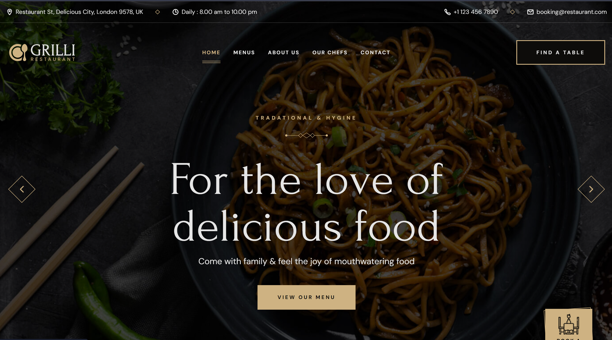
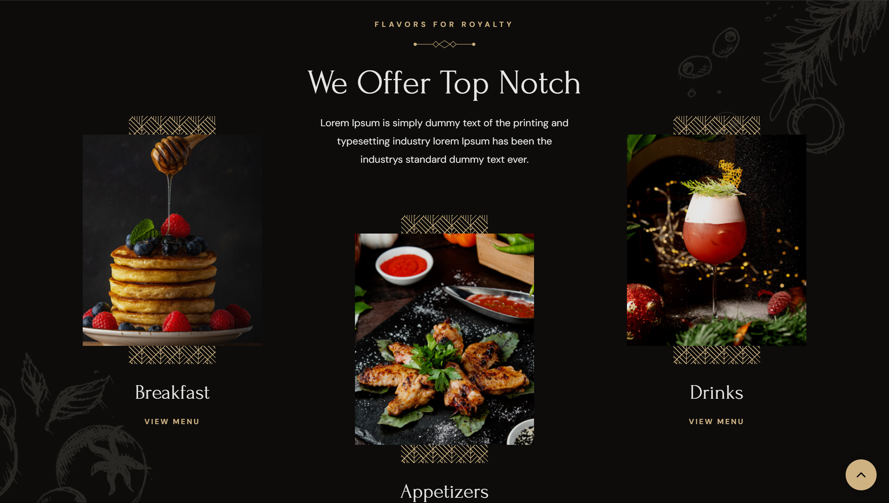
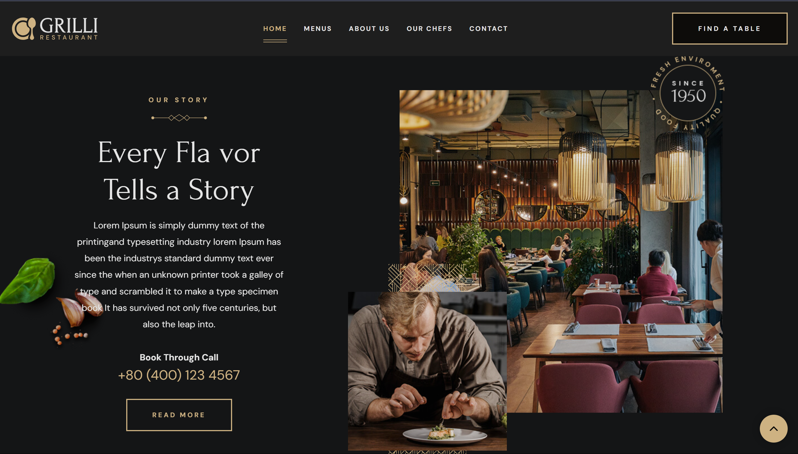
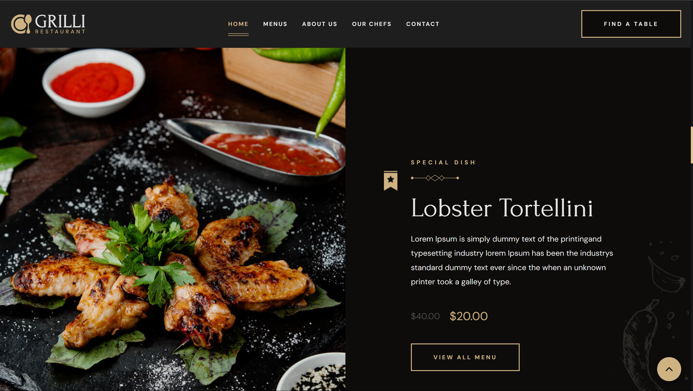
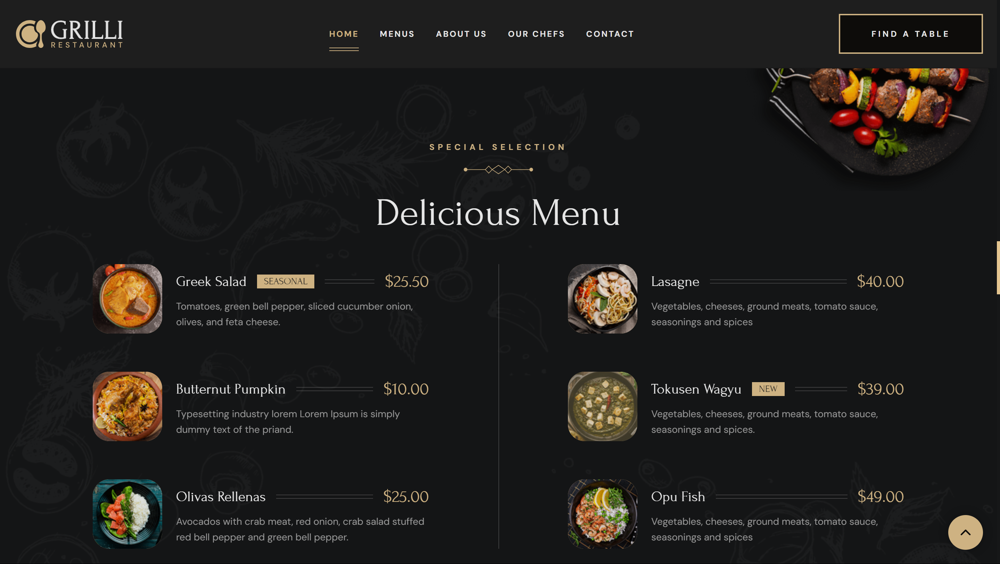
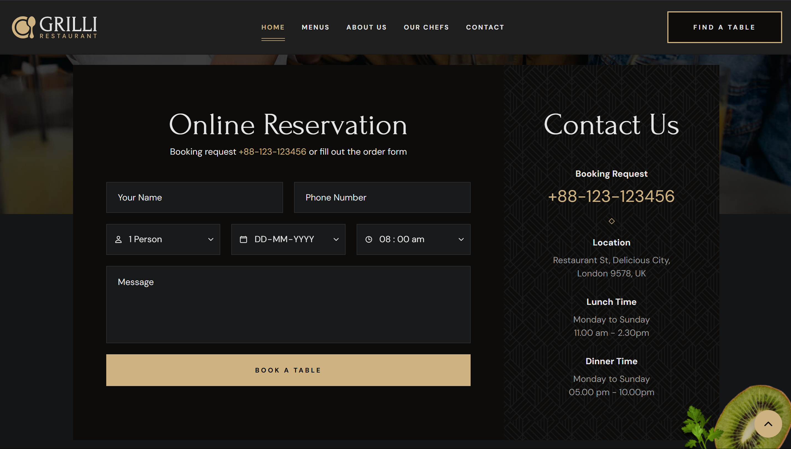
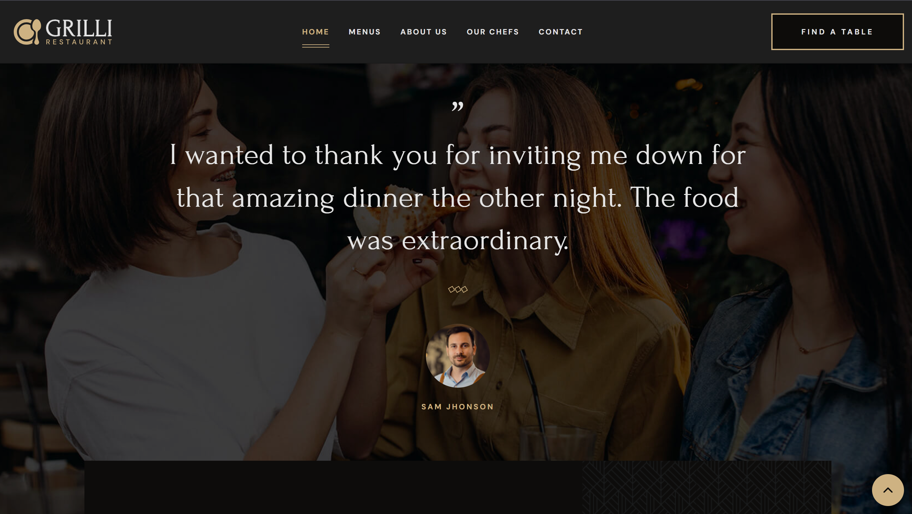
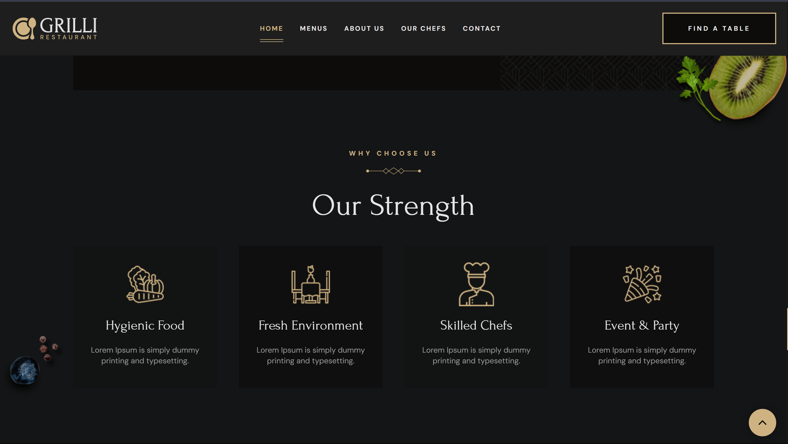
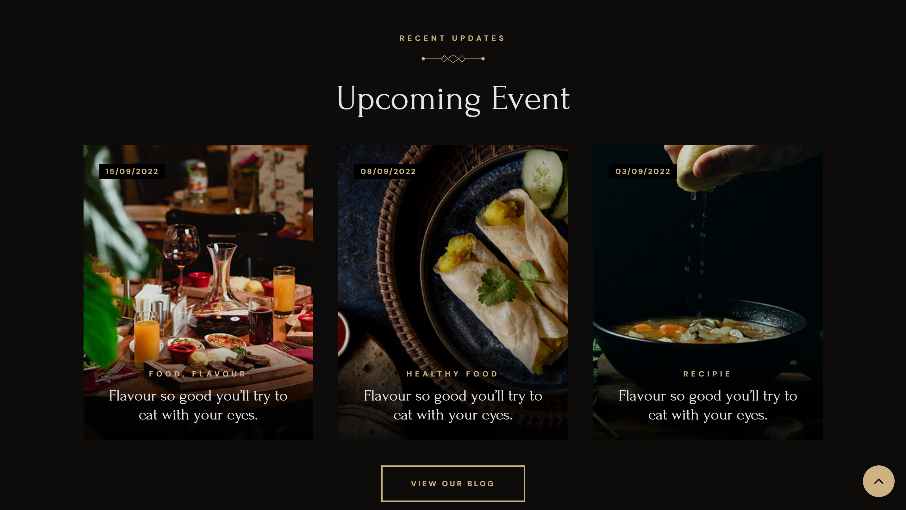
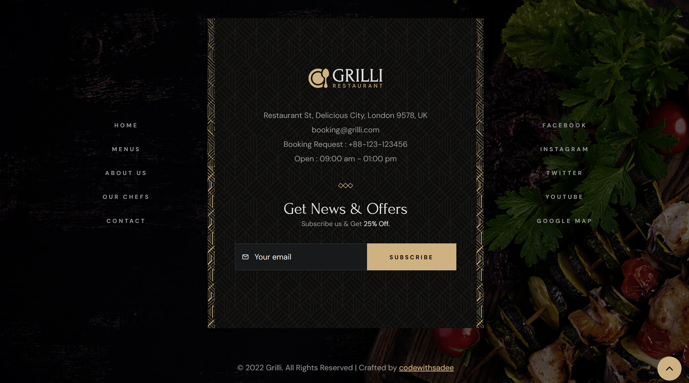

<div align="center">

  [](https://www.hackerrank.com/profile/dens22019_it)
  [](https://github.com/ddensingh/restaurent)
  [](https://leetcode.com/u/mKftdOvCXL/)
  [](https://www.linkedin.com/in/ddensingh/)

  <br /><br />

  <h2 align="center">🍽️ Grilli - Restaurant Website 🍽️</h2>

  **Grilli** is a modern, fully responsive restaurant website, designed for a seamless experience on all devices. Built with **HTML**, **CSS**, and **JavaScript**, it provides a sleek, user-friendly interface for showcasing restaurants with style.

  <a href="https://restaurent-alpha.vercel.app/"><strong>🚀 Live Demo Here ➥</strong></a>

</div>

---

## 📸 Demo Screenshots

Take a look at **Grilli** in action! Below are screenshots demonstrating its user-friendly design, responsiveness, and functionality across multiple pages and devices.

---

### 🖥️ Home Page

A sleek and modern landing page designed with a clear call-to-action and intuitive navigation.



---

### 🍽️ Menu Page

Beautifully presented menu items with smooth transitions, optimized for mobile and desktop.



---

### 🛒 Cart Page

A streamlined cart interface with an easy-to-use system for adding and removing items.



---

### 📄 About Us Page

Learn more about the restaurant's story with a visually engaging "About Us" page.



---

### 📞 Contact Page

A clean and professional contact page to allow customers to easily get in touch.



---

### 📲 Responsive Design

**Grilli** adapts to all device sizes, providing a smooth experience whether you’re browsing on a phone, tablet, or desktop.



---

### 🏎️ Fast Loading Times

Optimized code ensures fast page load times for an optimal user experience.



---

### 🛠️ Interactive Elements

Enjoy interactive elements such as hover effects, smooth animations, and dynamic transitions.



---

### 🔍 High-Resolution Images

All images and visual content are in high-resolution, providing a crisp and professional look.



---

### 💡 Smooth User Experience

**Grilli** is designed with simplicity and smoothness in mind, allowing for an enjoyable browsing experience.



---

## 🛠️ Features

- **Responsive Design:** Optimized for all screen sizes including desktop, tablet, and mobile.
- **Elegant UI:** Smooth transitions, interactive elements, and intuitive layout.
- **User-Friendly:** Easy to navigate, with clear calls to action for customers.
- **Fast & Efficient:** Built with performance and speed in mind.

---

## 🚀 Technologies Used

- **HTML5:** Semantic markup for better SEO and accessibility.
- **CSS3:** Modern styling techniques including Flexbox and Grid.
- **JavaScript:** Dynamic interactions and responsive functionalities.

---

## ⚙️ Prerequisites

Before you begin, ensure you have the following installed:

- **Git:** Version control system ([Download Git](https://git-scm.com/downloads))
- **Code Editor:** VS Code or any editor of your choice ([Download VS Code](https://code.visualstudio.com/Download))

---

## 💻 Run Locally

Follow these instructions to clone and run **Grilli** on your local machine.

### For Linux and macOS:

```bash
sudo git clone https://github.com/codewithsadee/grilli.git
cd grilli
open index.html
